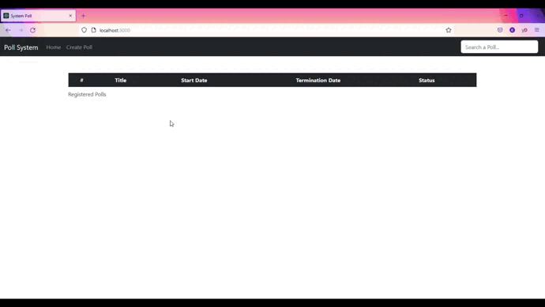

# react-node-system-polls
</img>

Project that manages polls with NodeJS and ReactJS

### Adjustments and Improvements
The project is still in development and the next updates will focus on the following tasks:,
- [ ] Remove multiple polls
- [ ] Clear input after data input
- [ ] Redirect page after action

## 📋 Prerequisites
Before starting, make sure you have met the prerequisites.
* You installed a code editor (vs code preferred)
* You installed NodeJS (npm)
* You installed MySQL

## ⚙️ Installation

### Client

1. `$ cd client`
2. `$ npm install or $ yarn install`

### Server

1. `$ cd server`
2. `$ npm install or $ yarn install`

## 💻 Use
To use it, follow these steps:

1. Start the MySQL service:

    Windows 10++:
    
      * `Control Panel > Search "Admin Tools" > Services > Search "MySQL", right-click and click "Start"`
    
    Linux: 
  
      * `$ /etc/init.d/mysql start`

### Client
1. `$ cd client`
2. `$ npm start or $ yarn start`

### Server
1. Change your MySQL database `server/index.js`
2. `$ cd server`
3. `$ node index.js`

## ✅ Functionalities
+ Poll management
+ Search polls
+ Sum and percentage of votes

## 📚 Libraries
The following libraries were used in building the project:
+ `Axios`
+ `Bootstrap`
+ `FontAwesome`

## 🚀 Technologies
The following technologies were used in building the project:
+ `ReactJS`
+ `NodeJS`
+ `MySQL`
